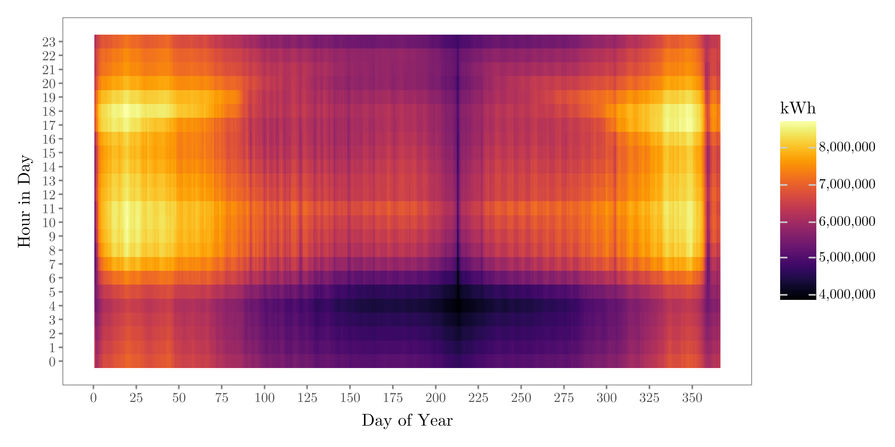
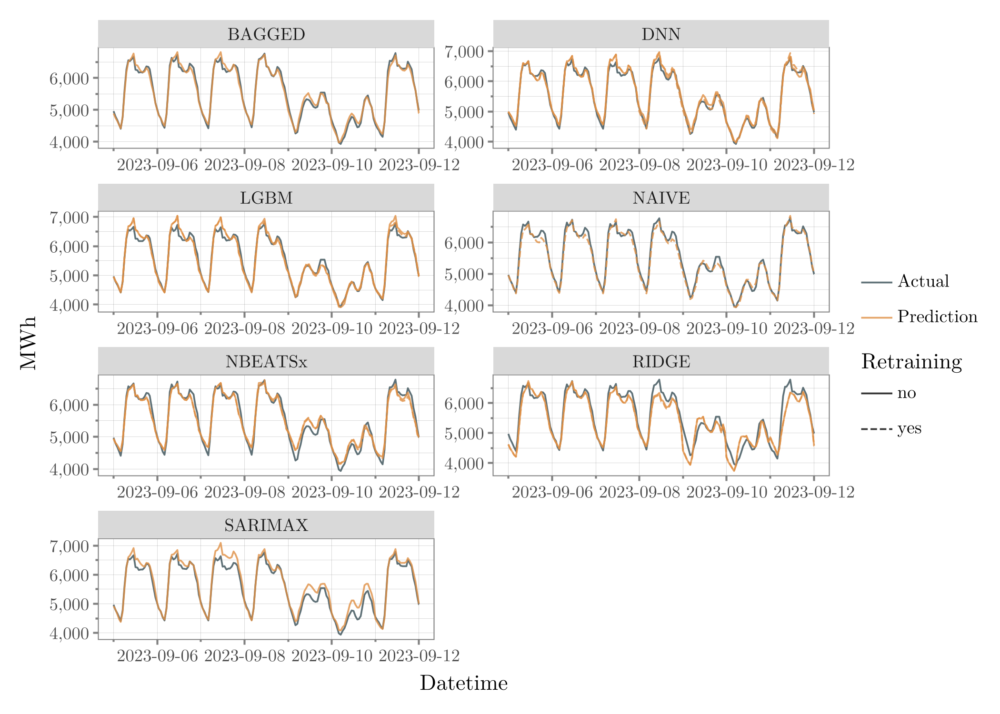
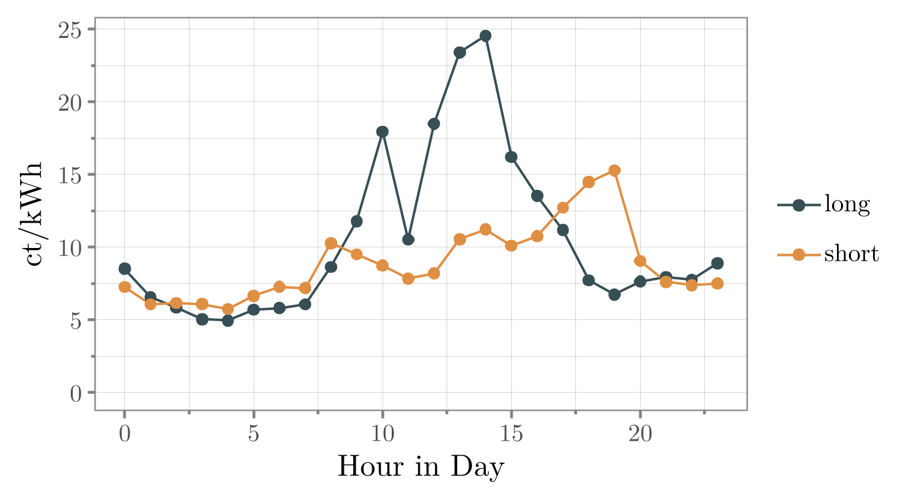
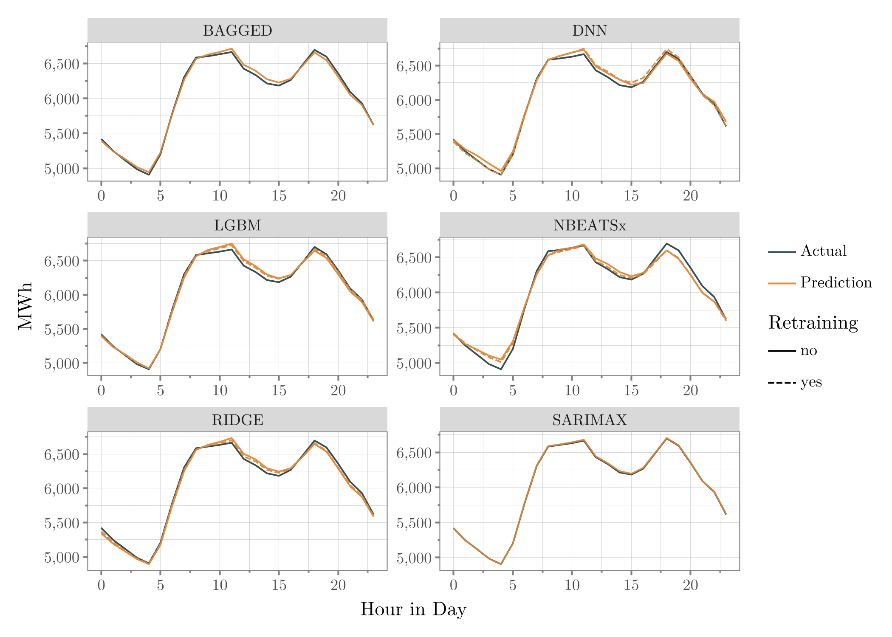
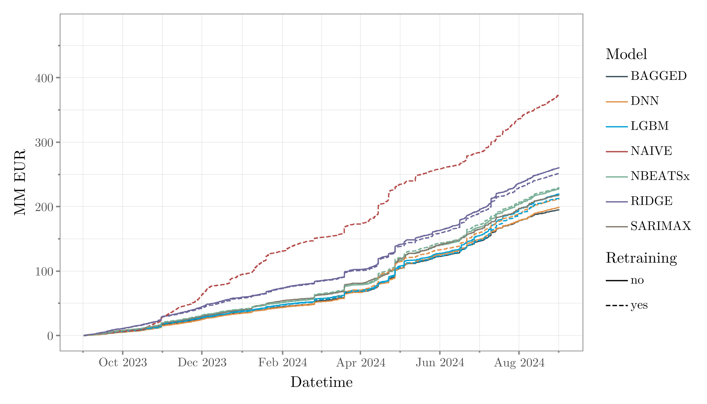
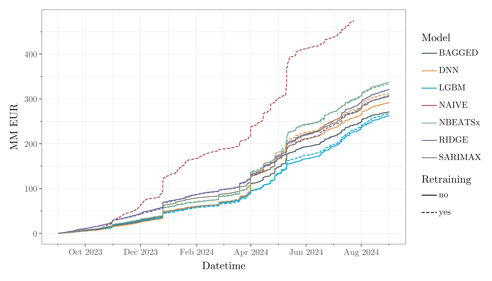

# A Comparative Study of Traditional Statistical Models and Deep Learning for Load Forecasting: SARIMAX vs. NBEATSx in the Swiss Power Grid

  <!--  -->
  

 

[**Link to Full Semester Paper (PDF)**](https://github.com/MathiasSteilen/semesterthesis-load-forecasting-switzerland/blob/main/Thesis.pdf)
[**Link to Full Semester Paper (HTML - Blog Post on my Website)**](https://mathiassteilen.github.io/posts/20250214-Load-Forecasting/#the-balance-group-managers-perspective)

This repository contains the contents of my semester project of comparing traditional time series modelling with state-of-the-art deep learning modelling for load forecasting in the Swiss power grid. Major things covered here are:

- Why do Balance Group Managers have a financial interest in accurate load forecasts?
- How does solar electricity generation impact grid load?
- Introductory theory on SARIMAX, NBEATSx, Deep Neural Networks, LightGBM and Ridge Regression
- Comparison of all model classes with both traditional loss metrics and balance costs on a one-year holdout set

## In a Nutshell

**Research Question**:

- How do traditional time series models (e.g. SARIMAX) compare to state-of-the-art deep learning models (e.g. NBEATSx) for day-ahead load forecasting, focusing on Swiss balance group managers (BGMs) aiming to minimise balancing costs?

**Evaluation using loss metrics**:

- Flexible models like NBEATSx, Deep Neural Networks and Gradient Boosting outperformed the traditional time series model using traditional loss metrics (RMSE, MAPE, MAE)
- The complex architecture of NBEATSx did not significantly outperform simpler methods like gradient boosting, despite higher computational demands
- Gradient boosting generalised better and has higher ease of use for fast development and retraining

| **Model**   | **Retraining** | **RMSE**     | **MAE**       | **MAPE (%)**  |
|-------------|----------------|--------------|---------------|---------------|
| BAGGED      | -              | 250,125.06   | 172,224.98    | 2.87          |
| LGBM        | Yes            | 252,853.24   | 177,004.18    | 2.92          |
| LGBM        | No             | 258,495.91   | 182,955.29    | 3.01          |
| DNN         | No             | 289,389.36   | 191,460.00    | 3.20          |
| DNN         | Yes            | 313,062.03   | 205,231.40    | 3.43          |
| NBEATSx     | No             | 319,813.00   | 220,405.47    | 3.72          |
| NBEATSx     | Yes            | 324,352.78   | 221,493.00    | 3.71          |
| SARIMAX     | No             | 369,562.82   | 236,811.10    | 3.89          |
| RIDGE       | Yes            | 335,067.88   | 257,353.52    | 4.40          |
| RIDGE       | No             | 338,158.51   | 261,399.10    | 4.48          |
| NAIVE       | -              | 590,135.64   | 421,695.81    | 6.89          |

**Ensemble Methods**:

- Simple mean-aggregation ensembles reduced prediction variance and improved performance (BAGGED = average of all models)
- Advanced ensemble techniques (e.g., stacking or dynamic seasonal weighting) offer promising opportunities for future research

**Seasonal and Temporal Biases**:

- Almost all models exhibited slight seasonal biases, potentially exposing BGMs to imbalanced cost vulnerabilities in Switzerland’s two-price balancing system, for example:
    - NBEATSx stood in the costlier direction during working hours and evenings, leading to increased balance costs despite good statistical metrics

  
  

**Holidays**:

- Deep learning models struggled with limited holiday data in the multioutput setting
- Specialised models or synthetic data augmentation for holidays could improve performance

**Evaluation using Balancing Costs**:
- Due to the effect of seasonal biases shown above, the order when evaluating with balance costs over the holdout period did not stay the same
- Excluding holidays (as they should be modelled separately, ideally), SARIMAX performed better than the much more flexible NBEATSx, as it is in general very true to the expected value
- LightGBM and Deep Neural Networks worked best (excluding holidays)

| Model   | Retraining | Average | Total | Change over Next (%) |
|---------|------------|---------|-------|----------------------|
| BAGGED  | -          | 5,840.28 | 1.95e+08 | -1.92 |
| DNN     | No         | 5,954.69 | 1.99e+08 | -5.94 |
| DNN     | Yes        | 6,330.84 | 2.12e+08 | -0.57 |
| LGBM    | Yes        | 6,366.83 | 2.13e+08 | -2.37 |
| SARIMAX | No         | 6,521.39 | 2.18e+08 | -0.81 |
| LGBM    | No         | 6,574.86 | 2.20e+08 | -3.61 |
| NBEATSx | No         | 6,821.43 | 2.28e+08 | -0.67 |
| NBEATSx | Yes        | 6,867.45 | 2.29e+08 | -8.90 |
| RIDGE   | Yes        | 7,538.36 | 2.52e+08 | -3.35 |
| RIDGE   | No         | 7,799.59 | 2.61e+08 | -30.20 |
| NAIVE   | -          | 11,173.84| 3.73e+08 | 0.00 |

Cumulative balance costs (Left: Without holidays | Right: With Holidays)

  
  

**Practical Recommendations**:

- Use diverse models and tailored ensembles to address biases and enhance reliability
- Select models considering both statistical accuracy and economic implications (e.g., asymmetric loss functions)
- Focus on holidays separately and run a different model on these days, as they can cause significant impact on the final result
- Integrate temporal and contextual variations into loss metrics to align forecasts with practical cost-minimisation goals

## Abstract

Short-term consumption forecasting is essential for maintaining the balance of demand and supply in the power grid. As a financial incentive, Switzerland's transmission system operator uses bidirectional penalties to pass on costs arising from grid balancing with control energy to the responsible balance group managers. Given the sharp rise in balancing costs in recent years, effective forecasting models are more crucial than ever for improving grid stability and minimisation of balancing energy. This study investigates whether advanced methods such as NBEATSx, LightGBM and Deep Neural Networks can outperform traditional time series models like SARIMAX, Ridge Regression and Seasonal Naive in the context of load forecasting. The analysis of results is split into two parts: Evaluation using traditional loss metrics (RMSE, MAE, MAPE) and evaluation based on actual incurred balance costs. When evaluating with traditional loss metrics, the gradient boosting LightGBM model demonstrated superior overall performance, consistently outperforming other approaches by a considerable margin. Furthermore, NBEATSx demonstrates significant improvement over the traditional time series model SARIMAX. Notably, ensemble methods, in this case the average over all model predictions, showed significant potential in mitigating individual model limitations, improving on every single model's performance. Critically, the study reveals that model performance is not uniform across different time scales, with significant variations in accuracy during working hours, weekends, and holiday periods. On the other hand, using incurred balance costs as the evaluation metric, which aligns more closely with practitioners' economic incentives, the tendencies of each model to over- or underestimate the expected value given a temporal dimension, such as hour of day, shuffle the leaderboard. In this case, SARIMAX, staying closer to the expected value, performs better than the complex NBEATSx model which consistently places the balance group in the unfavourable, costlier direction. Additionally, gradient boosting seems to learn holidays better than other model classes, putting it in the best performing position. The findings underscore the importance of moving beyond traditional symmetric loss metrics to train and evaluate forecasting models and instead emphasise the economic implications of prediction errors by accounting for the asymmetry of imbalance costs across temporal features like hour of day. The results also suggest that future work should focus on advanced ensembling techniques to combine models dynamically based on their complementary strengths and biases and devoting further attention to the critical holidays, which have been a pivotal factor in each model's final performance.
